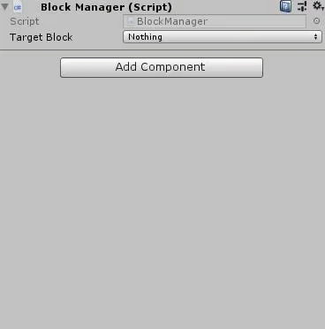
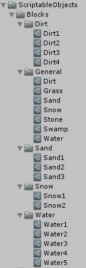
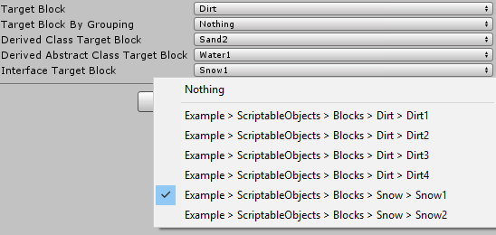
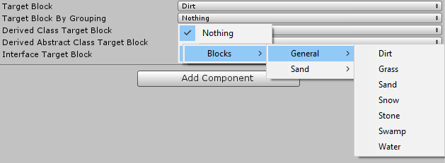
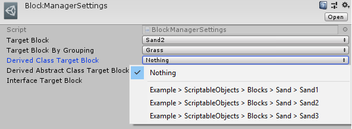
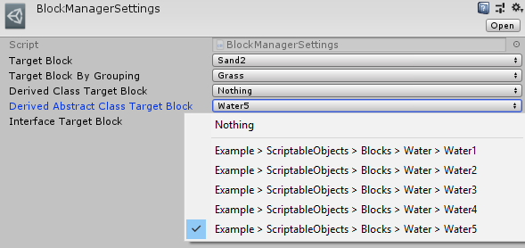

# ScriptableObjectDropdown
ScriptableObjectDropdown is an attribute for the Unity Inspector.
It is used for showing ScriptableObjects which are created in your project, in dropdown menu and select between them in Inspector.



# Usage Example
1. Clone this repository or download the latest [release package available](https://github.com/ATHellboy/ScriptableObjectDropdown/releases) (There isn't an example folder in `.unitypackage`).

2. There are some options here:
* Create a `ScriptableObject` class which you want to create specified objects by that.

```cs
using UnityEngine;

[CreateAssetMenu(menuName = "Create Block")]
public class Block : ScriptableObject
{
    // Some fields
}
```

* Create a class that inherits another `ScriptableObject` class.

```cs
using UnityEngine;

[CreateAssetMenu(menuName = "Blocks/Sand")]
public class SandBlock : Block
{
    // Some fields and functions
}
```

* Create a abstract `ScriptableObject` class then antoher class which inherits this abstract class.

```cs
using UnityEngine;

public abstract class AbstarctBlock : ScriptableObject
{
    // Some fields and functions
}
```

```cs
using UnityEngine;

[CreateAssetMenu(menuName = "Blocks/Water")]
public class WaterBlock : AbstarctBlock
{
    // Some fields and functions
}
```

* Create an interface and some `ScriptableObject` classes which inherit this interface. The interface is used for grouping.

```cs
public interface IBlock
{
    // Some properties and functions signature
}
```

```cs
using UnityEngine;

[CreateAssetMenu(menuName = "Blocks/Dirt")]
public class DirtBlock : ScriptableObject, IBlock
{
    // Some fields and functions
}
```

```cs
using UnityEngine;

[CreateAssetMenu(menuName = "Blocks/Snow")]
public class SnowBlock : ScriptableObject, IBlock
{
    // Some fields and functions
}
```

3. Create ScriptableObjects in the project.



4. Use `ScriptableObjectDropdown` attribute by setting type of specified `ScriptableObject` derived class and optional grouping (Default grouping is `None`) behind `ScriptableObjectReference` type variable like these in MonoBeahviour or ScriptableObject derived classes.

**MonoBehavior**

```cs
using ScriptableObjectDropdown;
using UnityEngine;

public class BlockManager : MonoBehaviour
{
    // Without grouping (default is None)
    [ScriptableObjectDropdown(typeof(Block))] public ScriptableObjectReference targetBlock;
    // By grouping
    [ScriptableObjectDropdown(typeof(Block), grouping = ScriptableObjectGrouping.ByFolder)]
    public ScriptableObjectReference targetBlockByGrouping;
    // Derived class
    [ScriptableObjectDropdown(typeof(SandBlock))] public ScriptableObjectReference derivedClassTargetBlock;
    // Derived abstract class
    [ScriptableObjectDropdown(typeof(AbstarctBlock))] public ScriptableObjectReference derivedAbstractClassTargetBlock;
    // Interface
    [ScriptableObjectDropdown(typeof(IBlock))] public ScriptableObjectReference interfaceTargetBlock;
}
```





**ScriptableObject**
```cs
using UnityEngine;
using ScriptableObjectDropdown;

[CreateAssetMenu(menuName = "Create Block Manager Settings")]
public class BlockManagerSettings : ScriptableObject
{
    // Without grouping (default is None)
    [ScriptableObjectDropdown(typeof(Block))] public ScriptableObjectReference targetBlock;
    // By grouping
    [ScriptableObjectDropdown(typeof(Block), grouping = ScriptableObjectGrouping.ByFolder)]
    public ScriptableObjectReference targetBlockByGrouping;
    // Derived class
    [ScriptableObjectDropdown(typeof(SandBlock))] public ScriptableObjectReference derivedClassTargetBlock;
    // Derived abstract class
    [ScriptableObjectDropdown(typeof(AbstarctBlock))] public ScriptableObjectReference derivedAbstractClassTargetBlock;
    // Interface
    [ScriptableObjectDropdown(typeof(IBlock))] public ScriptableObjectReference interfaceTargetBlock;
}
```





# License
MIT License

Copyright (c) 2019 Alireza Tarahomi

Permission is hereby granted, free of charge, to any person obtaining a copy
of this software and associated documentation files (the "Software"), to deal
in the Software without restriction, including without limitation the rights
to use, copy, modify, merge, publish, distribute, sublicense, and/or sell
copies of the Software, and to permit persons to whom the Software is
furnished to do so, subject to the following conditions:

The above copyright notice and this permission notice shall be included in all
copies or substantial portions of the Software.

THE SOFTWARE IS PROVIDED "AS IS", WITHOUT WARRANTY OF ANY KIND, EXPRESS OR
IMPLIED, INCLUDING BUT NOT LIMITED TO THE WARRANTIES OF MERCHANTABILITY,
FITNESS FOR A PARTICULAR PURPOSE AND NONINFRINGEMENT. IN NO EVENT SHALL THE
AUTHORS OR COPYRIGHT HOLDERS BE LIABLE FOR ANY CLAIM, DAMAGES OR OTHER
LIABILITY, WHETHER IN AN ACTION OF CONTRACT, TORT OR OTHERWISE, ARISING FROM,
OUT OF OR IN CONNECTION WITH THE SOFTWARE OR THE USE OR OTHER DEALINGS IN THE
SOFTWARE.
